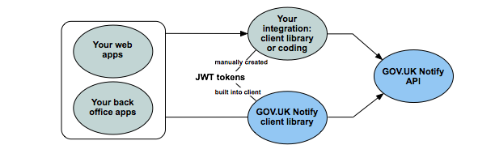

About this document
==========================
This document is for public sector [?] developers, technical architects, and service managers who want to use the GOV.UK Notify platform to send notifications to users of their digital service.

About GOV.UK Notify
====================
GOV.UK Notify is a cross-government platform, currently in beta, that lets government services and agencies [?] send notifications by sms or email.

There are two ways to send notifications:

* use the [GOV.UK Notify](https://www.notifications.service.gov.uk/) web application
* [integrate your web applications or back office systems](#integrateNotify)  with the GOV.UK Notify API

To find out more about GOV.UK Notify, see the [Government as a Platform](https://governmentasaplatform.blog.gov.uk/) blog.

Before you start
==================

To use GOV.UK Notify, you need:

* an email address from a local or central government organisation
* a mobile number for 2-factor authentication


Quick start guide to GOV.UK Notify
===================================

To get started:

1. Register for a [GOV.UK Notify](https://www.notifications.service.gov.uk/) account. You will need your mobile phone for 2-factor authentication.
2. Add a new service.

 At first your service will be in trial mode. In trial mode you will only be able to send test sms and email notifications to your own mobile number or email address. When you’re fully integrated and ready to go live, send a request to the GOV.UK Notify team.

3. Add a template so you can send sms and email notifications. You can personalise the template using double brackets for variables. For example:

  Dear ((name))

  Your ((item)) will expire on ((date)).

4. Upload a csv file containing a header row matching the variables in your template, and data rows with values to use for the variables.
5. Send an sms or email notification.
6. Create a new API key. This will be used to connect to the API.

  You can provide all your developers with test keys so they can experiment in the Sandbox environment. But keep the number of keys for real integrations to a minimum number of people on your team.

<a name="integrateNotify"></a>
Integrate the GOV.UK Notify API into your service
===================================================

GOV.UK Notify provides an API that allows you to create text and email notifications and get the status of notifications you have sent.

API integration
------------------



There are two ways to integrate the API into your service:
* use a client library provided by GOV.UK Notify - there is currently a [python library](https://github.com/alphagov/notifications-python-client) and more will be added in different languages
* develop your own integration to produce requests in the correct format

GOV.UK Notify uses [JWT tokens](https://jwt.io/) for authentication and identification. The GOV.UK Notify client library encodes and decodes JWT tokens when making requests to the GOV.UK Notify API.  If you don't use this library, you must manually create tokens yourself. 

For examples of how to encode and decode JWT tokens, see [authentication.py](https://github.com/alphagov/notifications-python-client/blob/master/notifications_python_client/authentication.py) in the GOV.UK Notify Python client library.

A JWT token contains, in encrypted format:
* your service ID - identifies your service
* your API key (in JWT token terms this is called the client ID) - used to sign tokens during requests for API resources
* an indication of what you're trying to do - GET, POST, etc.
* the endpoint you're trying to access

Use the [GOV.UK Notify](https://www.notifications.service.gov.uk/) web application to find your service ID and create API keys. 

**Important:** API keys are secret, so save them somewhere safe. Do not commit API keys to public source code repositories.

JWT tokens: claims
------------------

JWT tokens have a series of standard and application-specific claims.

JWT standard claims:
```
{
  "typ": "JWT",
  "alg": "HS256"
}
```

GOV.UK Notify application-specific claims:
```
{
  iss: 'string', // service id
  iat: 0, // creation time in  epoch seconds (UTC)
  req: 'string', // signed request
  pay: 'string', // signed payload (POST requests only)
}
```

The GOV.UK Notify API tokens sign the:
* request being made
* payload (for POST requests)

The signing algorithm is the HMAC signature, using the provided key SHA256 hashing algorithm.

Request signing is of the form HTTP METHOD PATH:
```
GET /notification/1234
```

Payload signing requires the actual payload to be signed, not the JSON object. Make sure you serialize the object first, then sign the serialized object.

API client libraries
---------------------

GOV.UK Notify supports a python client library:

[GOV.UK Notify Python client](https://github.com/alphagov/notifications-python-client)

This provides example code for calling the API and for constructing the API tokens.


API endpoints
----------------

You can use the GOV.UK Notify API to:
* send a notification
* retrieve one notification
* retrieve all notifications

To send a text notification:
```
POST /notifications/sms
```

```
{
  'to': '+447700900404',
  'template': 1, 
  'personalisation': {
    'name': 'myname',
    'date': '2016'
  }
}
```
To send an email notification:
```
POST /notifications/email
```

```
{
  'to': 'email@gov.uk',
  'template': 1,
    'personalisation': {
    'name': 'myname',
    'date': '2016'
  }
}
```

where:
* `to` is the phone number (required)
* `template` is the template ID to send (required)
* `personalisation` (optional) specifies the values to be used in your templates

<a id="coderesponse"></a>
The response will be:
```
{
   'data':{
      'notification': {
         'id':1
      }
   }
}
```

To retrieve the status of a single text or email notification:
```
GET /notifications/{id}
```

```
{
   'data':{
      'notification': {
         'status':'delivered',
         'created_at':'2016-01-01T09:00:00.999999Z',
         'to':'+447827992607',
         'template_type':'sms',
         'sent_at':'2016-01-01T09:01:00.999999Z',
         'id':1,
         'message':'...',
         'job_id':1,
         'sender':'sms-partner'
      }
   }
}
```
where:
* `status` is the the status of the notification; this can be `sending`, `delivered`, `failed` 
* `template_type` is `sms` or `email`
* `job_id` is the unique identifier for the process of sending and retreiving the notification
* `message` is the content of message
* `sender` may be the provider [Do we want to say who is sending it?]

The above fields are populated once the message has been processed; initially you get back the [response](#coderesponse)  indicated above.

To get the status of all notifications: 
```
GET /notifications
```

```
{
   'data':[{
      'notification': {
         'status':'delivered',
         'created_at':'2016-01-01T09:00:00.999999Z',
         'to':'+447827992607',
         'template_type':'sms',
         'sent_at':'2016-01-01T09:01:00.999999Z',
         'id':1,
         'message':'...',
         'job-id':1,
         'sender':'sms-partner'
      }
   },
   {
         'notification': {
         'status':'delivered',
         'created_at':'2016-01-01T09:00:00.999999Z',
         'to':'+447827992607',
         'template_type':'email',
         'sent_at':'2016-01-01T09:01:00.999999Z',
         'id':1,
         'message':'...',
         'job_id':1,
         'sender':'email-partner'
      }
   }...]
}
```
This list is split into pages. To scroll through the pages run:

```
GET /notifications?&page=2
```


GOV.UK Notify API code
------------------------

The GOV.UK Notify API code is open sourced at:

[GOV.UK Notify API](https://github.com/alphagov/notifications-api) 


Functional testing
---------------------
[Some info in Rosalie’s notes.]


Security
----------
[Some info in Rosalie’s notes.]

Privacy
--------


